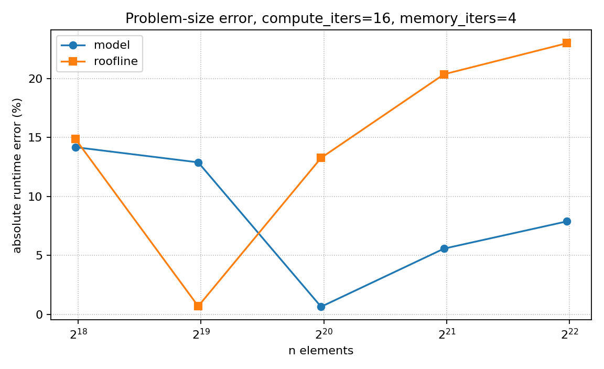
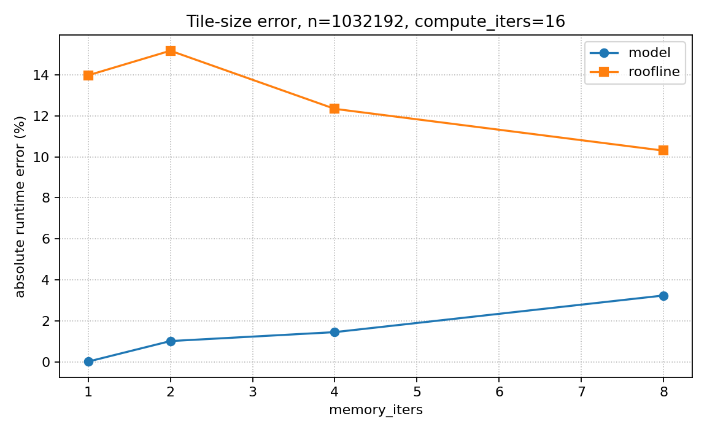
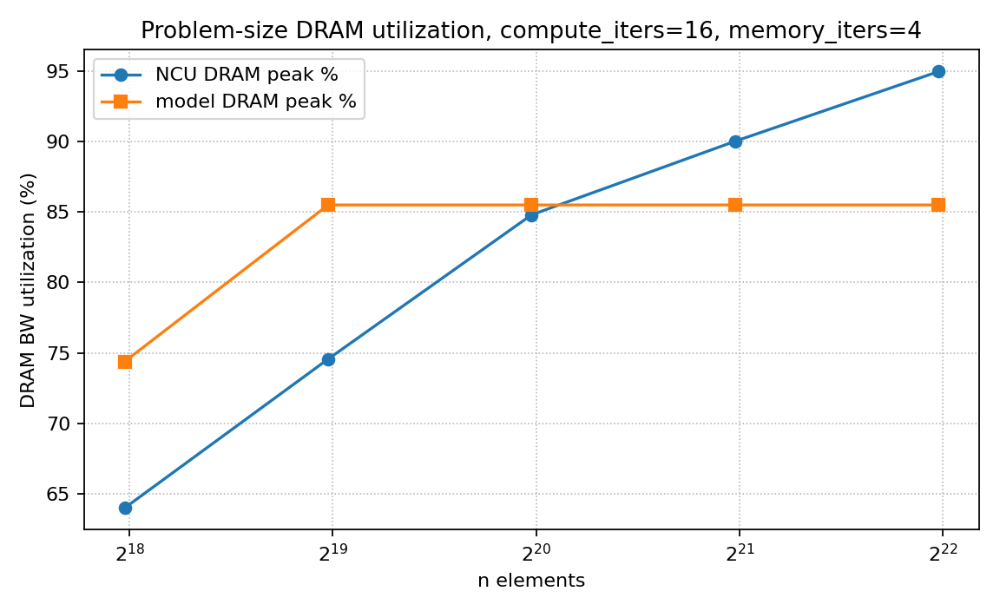
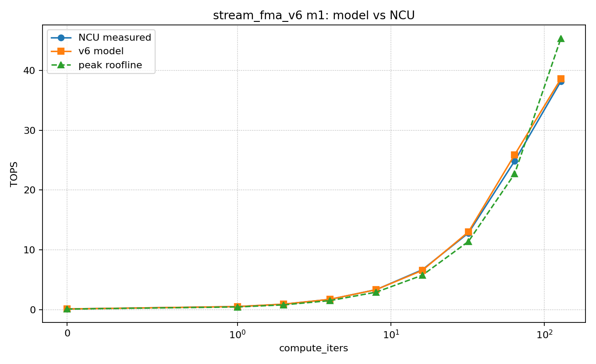
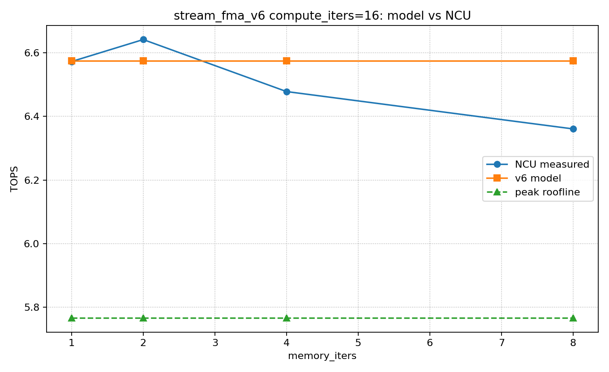
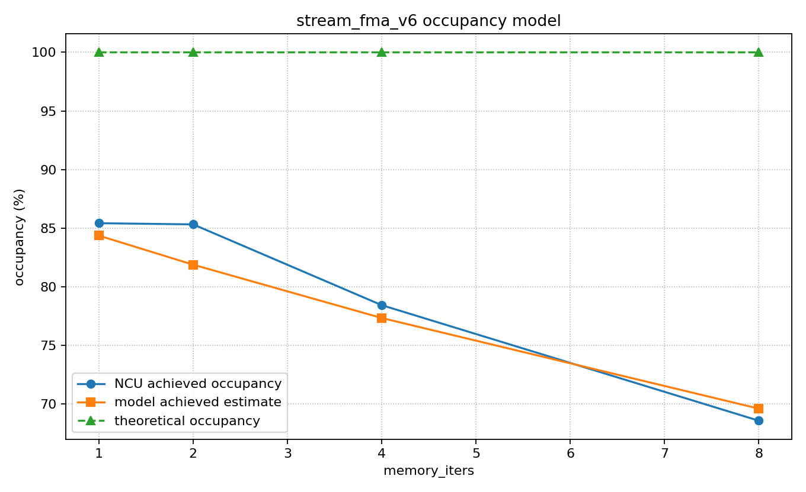
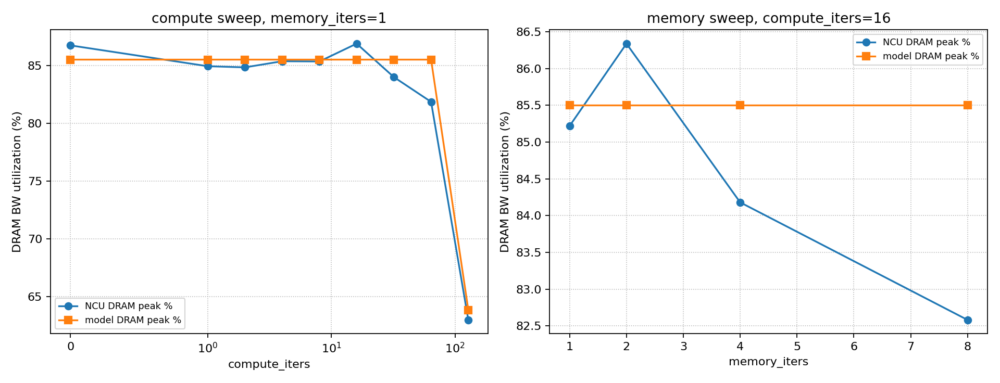
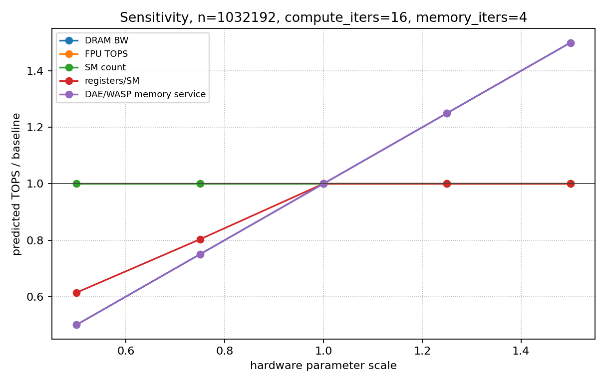

# GPU Kernel Performance Model Report

## 1. Kernel Explanation

### Streaming FMA Kernel

The kernel is a streaming FMA microbenchmark. FMA means fused multiply-add: `fmaf(a, b, c)` computes `a * b + c` as one fused FP32 instruction. In this report, one FMA instruction is counted as 2 floating-point operations because it performs one multiply and one add.

Each CTA owns a contiguous tile of `blockDim.x * memory_iters` elements. Each thread loads `memory_iters` elements from three input arrays, applies a repeated FMA chain, and stores `memory_iters` output values. This creates a simple load-compute-store structure that is useful for studying how streaming DRAM traffic overlaps with scalar FP32 execution.

The core indexing is:

```cpp
block_base = blockIdx.x * blockDim.x * MemoryIters;
idx[m] = block_base + m * blockDim.x + threadIdx.x;
```

### Load Phase

The load phase computes one global index per element handled by the thread. For each `m`, all lanes in a warp access consecutive locations, so the loads from `a[idx[m]]`, `b[idx[m]]`, and `c[idx[m]]` are coalesced. The loaded values are kept in per-thread registers as `acc[m]`, `x[m]`, and `y[m]`.

```cpp
for (int m = 0; m < MemoryIters; ++m) {
  idx[m] = block_base + m * blockDim.x + threadIdx.x;
  acc[m] = a[idx[m]];
  x[m]   = b[idx[m]];
  y[m]   = c[idx[m]];
}
```

### Compute Phase

The compute phase repeatedly updates the loaded register values. For each element and each `compute_iters` step, the kernel executes 3 FMA instructions, or 6 FP32 operations. This phase does not load more global data, so increasing `compute_iters` increases arithmetic intensity while keeping the same logical element stream.

```cpp
for (int r = 0; r < compute_iters; ++r) {
  for (int m = 0; m < MemoryIters; ++m) {
    acc[m] = fmaf(acc[m], 1.0001f, x[m]);
    x[m]   = fmaf(x[m],   0.9999f, y[m]);
    y[m]   = fmaf(y[m],   1.0003f, acc[m]);
  }
}
```

### Store Phase

The store phase writes one output value for every element loaded by the thread. The output combines the final accumulator streams, so each logical element has 3 input loads and 1 output store at the algorithm level.

```cpp
for (int m = 0; m < MemoryIters; ++m) {
  out[idx[m]] = acc[m] + x[m] + y[m];
}
```

### Parameter Meaning

`compute_iters` is the main arithmetic-intensity knob. Larger values add more FMA work per loaded element, push the kernel toward the compute-bound region, and reduce the fraction of runtime explained by DRAM bandwidth.

`memory_iters` is the per-thread batching knob. Larger values make each thread load, compute, and store more elements, which reduces CTA count for a fixed `n`, increases register pressure, and changes achieved occupancy and latency hiding. The full-tile rule is `n % (threads_per_cta * memory_iters) == 0`, so every launched thread has valid work.

## 2. Model

Inputs are `n`, `compute_iters`, `memory_iters`, `threads_per_cta`, FP32 TOPS, DRAM bandwidth, SM count, register-file size, and warp/CTA limits.

### Basic Outputs Required by Mini-Project

The required model outputs are performance in TOPS and achieved operational intensity. TOPS means tera-operations per second. Operational intensity means operations per byte.

```text
elements_per_cta = threads_per_cta * memory_iters
ctas = n / elements_per_cta
ops = n * (6 * compute_iters + 2)
algorithm_bytes = n * 16
OI_algorithm = ops / algorithm_bytes
modeled_dram_bytes = n * dram_bytes_per_element
OI_dram = ops / modeled_dram_bytes
compute_time = ops / effective_fpu_ops_per_s
dram_time = modeled_dram_bytes / effective_dram_bytes_per_s
time = max(compute_time, dram_time)
TOPS = ops / time / 1e12
```

`ops` is the total FP32 operation count. The term `6 * compute_iters` comes from 3 FMA instructions per element per compute iteration, with 2 operations per FMA. The `+ 2` term is the final output add chain, `acc + x + y`.

`algorithm_bytes` is the logical traffic from the CUDA source: 3 FP32 loads and 1 FP32 store per element, or 16 B/element. `modeled_dram_bytes` is the NCU-calibrated DRAM traffic used by the bottleneck model. It is lower here because NCU reports this kernel as mostly read-dominated DRAM traffic.

Example for `n=1032192`, `compute_iters=16`, `memory_iters=4`:

```text
ctas = 1032192 / (256 * 4) = 1008
OI_algorithm = (6 * 16 + 2) / 16 = 6.125 ops/byte
```

### Extended Outputs

The extended outputs explain why the kernel reaches a particular TOPS value. They are not required by the mini-project statement, but they make the model useful for architecture analysis.

```text
resident_ctas_per_sm = min(CTA limit, warp limit, register limit, shared-memory limit)
resident_warps_per_sm = resident_ctas_per_sm * warps_per_cta
estimated_achieved_occupancy = estimated_active_warps_per_sm / max_warps_per_sm
predicted_dram_gbps = modeled_dram_bytes / time / 1e9
dram_utilization_pct = predicted_dram_gbps / peak_dram_gbps * 100
bottleneck = compute if compute_time >= dram_time else dram
```

Warp occupancy estimates how many warps are active on each SM relative to the hardware maximum. The model first computes the theoretical resident warps from CTA, warp, register, and shared-memory limits, then applies a wave-drain factor for small grids. Register counts come from `cuobjdump`: 12, 20, 36, and 40 registers/thread for `memory_iters=1,2,4,8`.

DRAM utilization predicts how much of peak DRAM bandwidth the kernel uses. It is computed from the modeled DRAM bytes divided by the predicted runtime, then normalized by the hardware peak DRAM bandwidth.

### Definitions and Calibrated Terms

Tuned constants are small and physical. Scalar-FMA efficiency captures that this kernel does not reach the ideal CUDA-core peak. The model uses 12 DRAM bytes per element because NCU reports mostly read DRAM traffic for this kernel. DRAM efficiency captures sustained streaming bandwidth. A wave-drain factor accounts for reduced average occupancy when the grid exposes fewer CTA waves.

`effective_fpu_ops_per_s` is `fpu_tops * compute_efficiency * 1e12`. It is the scalar FP32 compute rate available to this kernel after accounting for instruction mix and issue efficiency. `effective_dram_bytes_per_s` is `dram_bw_gbps * dram_efficiency * occupancy_bw_scale * 1e9`. It is the sustained DRAM service rate available to this streaming access pattern.

`dram_bytes_per_element` is the calibrated DRAM traffic per element. `dram_efficiency` captures the gap between peak DRAM bandwidth and the sustained bandwidth reached by this coalesced streaming kernel. `occupancy_bw_scale` reduces effective bandwidth when too few active warps are available to hide memory latency.

The main challenge is that algorithm bytes are 16 B/element, but NCU DRAM bytes are closer to 12 B/element. I address this by reporting algorithm OI separately from the NCU-like modeled DRAM traffic. The DRAM utilization submodel uses the same predicted runtime as the bottleneck model, so utilization falls naturally when the kernel becomes compute-bound.

## 3. Validation

Validation used actual NCU measurements on the RTX 5080. The model remains parameterized, so TitanV values can be substituted later.

Parameter sweeps:

- Problem size sweep: `n=[258048, 516096, 1032192, 2064384, 4128768]`, `compute_iters=16`, `memory_iters=4`.
- Tile size sweep: `n=1032192`, `compute_iters=16`, `memory_iters=1,2,4,8`.
- Compute sweep: `n=1032192`, `memory_iters=1`, `compute_iters=0..128`.

MAPE means Mean Absolute Percentage Error. It is computed as `(100 / N) * sum(abs((predicted_i - measured_i) / measured_i))`; lower is better. Rows with zero or invalid measured values are excluded.

Problem-size runtime MAPE:

- Model: `8.23%`
- Peak roofline: `14.43%`

Tile-size runtime MAPE:

- Model: `1.47%`
- Peak roofline: `11.44%`

DRAM BW utilization MAPE:

- Problem-size sweep: `9.35%`
- Tile-size sweep: `1.60%`















### Problem Size Results

| n | CTAs | measured TOPS | model TOPS | NCU DRAM peak % | model DRAM peak % | model error % | roofline error % |
| ---: | ---: | ---: | ---: | ---: | ---: | ---: | ---: |
| 258048 | 252 | 4.909 | 5.719 | 63.99 | 74.39 | -14.17 | -14.88 |
| 516096 | 504 | 5.727 | 6.574 | 74.56 | 85.50 | -12.88 | -0.69 |
| 1032192 | 1008 | 6.531 | 6.574 | 84.80 | 85.50 | -0.65 | 13.26 |
| 2064384 | 2016 | 6.940 | 6.574 | 90.02 | 85.50 | 5.57 | 20.35 |
| 4128768 | 4032 | 7.092 | 6.574 | 94.97 | 85.50 | 7.88 | 22.98 |

### Tile Size Results

| memory_iters | CTAs | measured TOPS | model TOPS | NCU DRAM peak % | model DRAM peak % | measured occ % | model occ % |
| ---: | ---: | ---: | ---: | ---: | ---: | ---: | ---: |
| 1 | 4032 | 6.572 | 6.574 | 85.22 | 85.50 | 84.81 | 84.36 |
| 2 | 2016 | 6.641 | 6.574 | 86.34 | 85.50 | 85.55 | 81.88 |
| 4 | 1008 | 6.478 | 6.574 | 84.18 | 85.50 | 77.26 | 77.33 |
| 8 | 504 | 6.360 | 6.574 | 82.58 | 85.50 | 68.42 | 69.60 |

The model performs well across memory-bound settings because it captures the effective DRAM traffic and streaming bandwidth. The peak roofline is less accurate: it is pessimistic in the memory-bound region because it uses algorithm bytes, and optimistic at high `compute_iters` because it assumes ideal scalar FMA throughput. The weakest model points are the smallest problem sizes, where launch and wave-drain effects dominate, and the largest problem sizes, where measured DRAM bandwidth rises above the single calibrated bandwidth.

## 4. Architecture Insight

The sensitivity analysis scales hardware parameters around the measured configuration for `n=1032192`, `compute_iters=16`, `memory_iters=4`.



This kernel is primarily a streaming memory-service workload until `compute_iters` becomes very large. Future GPUs or DAE/WASP-like architectures should improve:

- effective DRAM bandwidth and memory-service efficiency;
- load scheduling that reduces long scoreboard stalls;
- enough resident warps to hide memory latency;
- register capacity only when larger per-thread batching reduces occupancy.

Increasing FPU TOPS helps mostly after the kernel reaches the compute-bound region. For the DAE/WASP direction, the most useful feature is better overlap of loads with scalar FMA work, because the workload has simple coalesced streams and little algorithmic L1/L2 reuse.
